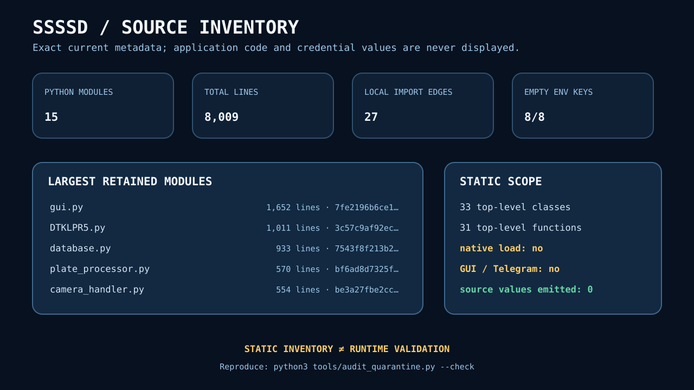
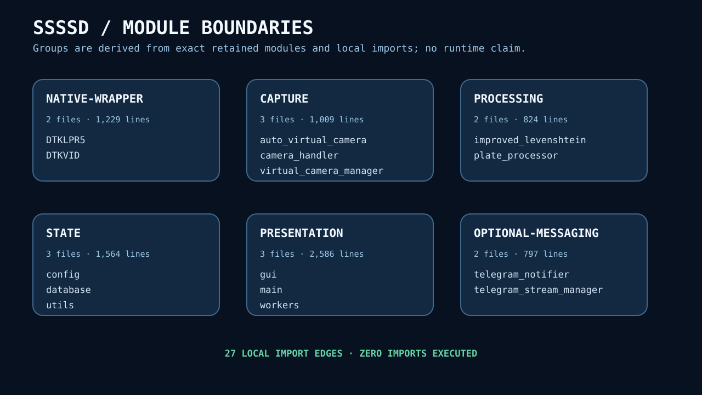
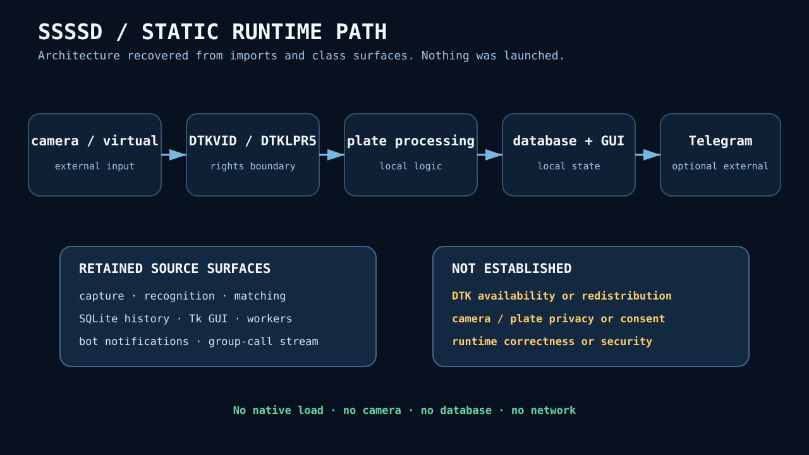
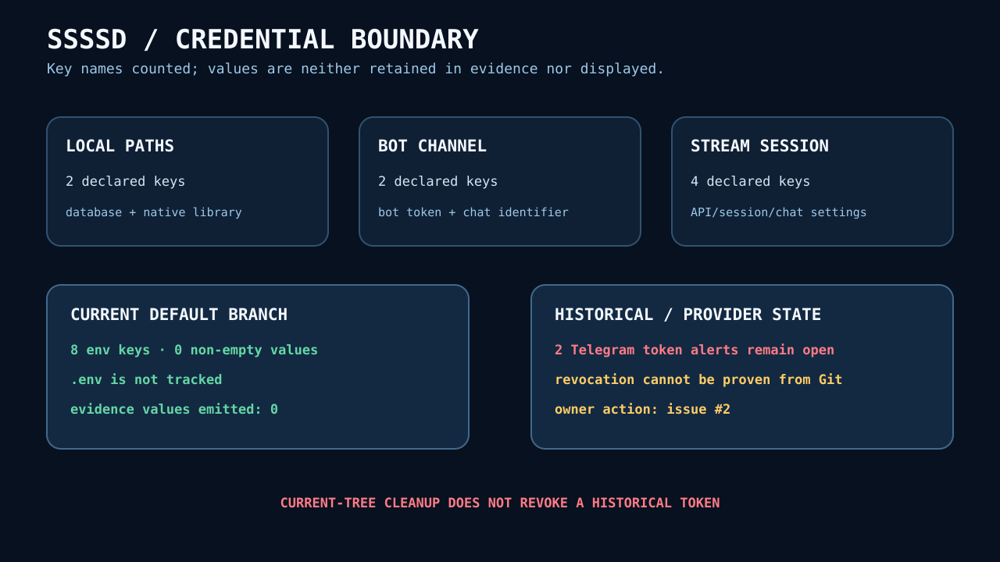
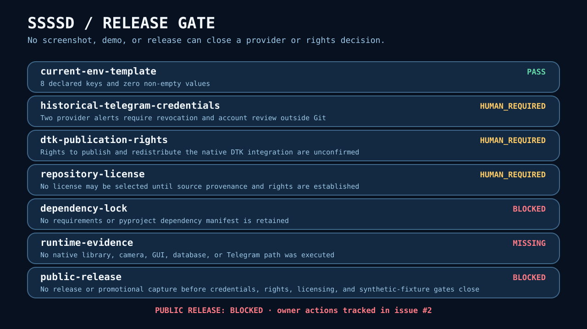

# ssssd · quarantined desktop LPR snapshot

This repository preserves a legacy Python desktop application that connected
camera inputs, native DTK LPR/video wrappers, local SQLite history, a Tk GUI,
and optional Telegram notification/streaming paths. It is now an auditable
**quarantine**, not a runnable product claim.

> **Release status: blocked.** Two historical Telegram bot-token alerts still
> require provider-side revocation, and publication rights for the DTK
> integration are unconfirmed. Do not publish a release, license, runtime
> screenshot, plate image, demo, or video until the owner actions in
> [issue #2](https://github.com/omar07ibrahim/ssssd/issues/2) are complete.

## Exact retained surface

The dependency-free audit binds the current source without importing or
executing it:

| Surface | Verified current fact | Boundary |
| --- | --- | --- |
| Python | 15 modules, 311,190 bytes, 8,009 lines | All files parse as AST; none is imported |
| Structure | 33 top-level classes, 31 top-level functions | Names and counts only, not behavioral correctness |
| Local graph | 27 exact local import edges across six layers | Static dependency direction, not runtime tracing |
| Non-local imports | 29 stdlib-or-external roots | No versions or installable lock are retained |
| Configuration | 8 declared \`.env.example\` keys, 0 non-empty values | Key names counted; values never emitted |
| Runtime | no native load, camera, GUI, database, or Telegram call | No recognition, latency, privacy, or reliability result |
| Rights | no repository license | Public visibility is not permission to reuse |

The canonical [JSON audit](docs/evidence/source-audit.json) contains exact
SHA-256 and Git-blob identifiers for every retained module. The
[CLI transcript](docs/evidence/source-audit.txt) is regenerated and compared
byte-for-byte.

## Module map

The six groups are derived from exact filenames and AST imports:

- native wrapper: \`DTKLPR5\`, \`DTKVID\`;
- capture: camera handler and virtual-camera modules;
- processing: plate processing and similarity logic;
- state: configuration, SQLite manager, and utilities;
- presentation: main application, GUI dialogs, and worker manager;
- optional messaging: Telegram bot and group-call streaming modules.

This map shows retained source organization. It does not establish that native
libraries are available, compatible, publishable, or safe to load.

## Static integration path

The application boundary spans camera/virtual-camera input, proprietary native
wrappers, plate processing, local history/GUI, and optional external messaging.
The auditor deliberately stops at AST metadata: it opens no device, resolves no
native symbol, creates no database, displays no plate, and contacts no network.

## Credential boundary

The current default branch no longer tracks \`.env\`, and all eight values in
\`.env.example\` are empty. That is a current-tree fact only. It does not revoke
either historical token or erase Git objects, forks, caches, and clones.

Never place a credential value, session file, chat identifier, database, plate
image, or private path in an issue or evidence artifact. Use GitHub's private
security-reporting flow for sensitive findings.

## Safe setup and reproduction

Only the static audit is supported today; it requires CPython and no package
installation:

\`\`\`bash
git clone https://github.com/omar07ibrahim/ssssd.git
cd ssssd
python3 tools/audit_quarantine.py --check
\`\`\`

A successful check recomputes every retained module hash, reparses all 8,009
lines, reconstructs the local import graph, verifies that the environment
template values remain empty, regenerates five SVGs plus JSON and text, and
compares every committed byte.

GitHub Actions repeats that process in pinned CPython 3.14.6 with a read-only
token and exact action revisions. See the
[evidence method](docs/evidence-method.md).

## Release gate

The absence of a GUI screenshot or demo is deliberate. A legitimate future
capture requires all of the following first:

- both historical Telegram tokens revoked and provider activity reviewed;
- source and DTK publication/redistribution rights documented;
- a compatible repository license selected from verified provenance;
- dependencies fully inventoried and hash-locked;
- synthetic plates/data with explicit generation and reuse rights;
- a bounded, network-isolated runtime protocol with privacy-safe outputs.

Until then, the repository makes no recognition-accuracy, speed, production,
privacy-compliance, real-camera, Telegram, or deployment claim.

## Security and reuse

Secret scanning and push protection are enabled. Local environments, Telegram
sessions, databases, logs, caches, and generated audit candidates are ignored.
See [SECURITY.md](SECURITY.md) for private reporting guidance.

There is intentionally no license while source and vendor rights remain
unresolved. Viewing or forking this audit does not grant permission to reuse the
retained application code, native integration, data, screenshots, or outputs.
